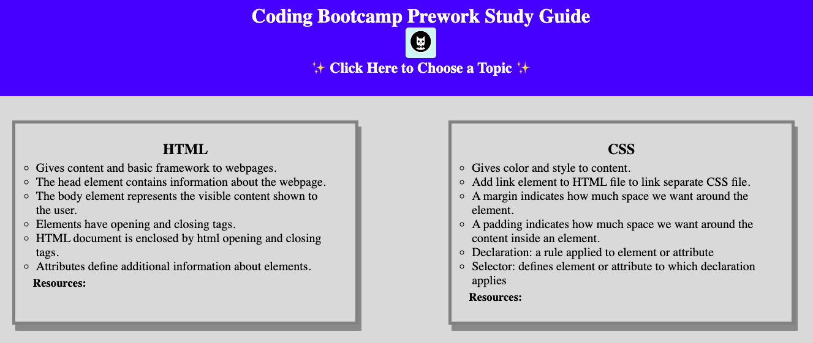
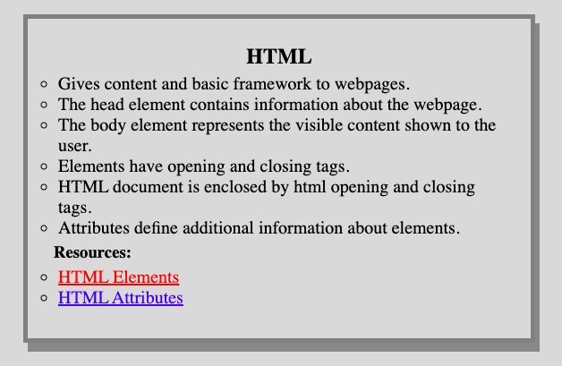

# Prework Study Guide Webpage

## Description

The Prework Study Guide was created to provide an organized platform for students to view notes from prework. This project was built not only to review key points from lessons, but the process itself was a learning experience in learning basic coding concepts. I learned about the basic components required to build a webpage and how they all work together. I plan to implement new features as I continue to learn new skills.

## Installation

N/A

## Usage

To access this application, visit the following URL: [https://rpecuch.github.io/prework-study-guide/](https://rpecuch.github.io/prework-study-guide/).

Notes for the different topics are divided into four sections entitled "HTML", "CSS", "Git", and "JavaScript". Scroll down to the desired section to review the notes.

### 8/21/22 Update

Added new features after spending the past few weeks learning about advanced CSS, JavaScript, and web APIs. Users can now view links to resources by hovering over the "Resources" sections. 

Users can also have a random topic chosen for them to study by clicking a button.

## Credits

N/A

## License

Please refer to the LICENSE in the repo.
